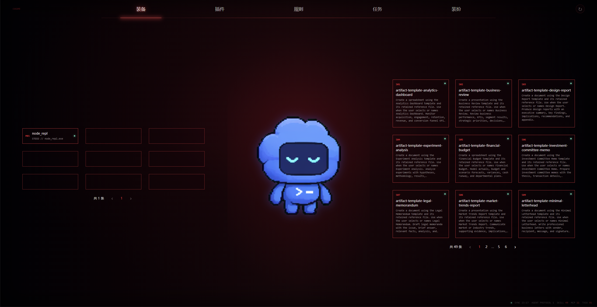
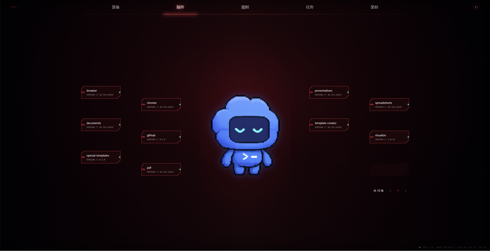
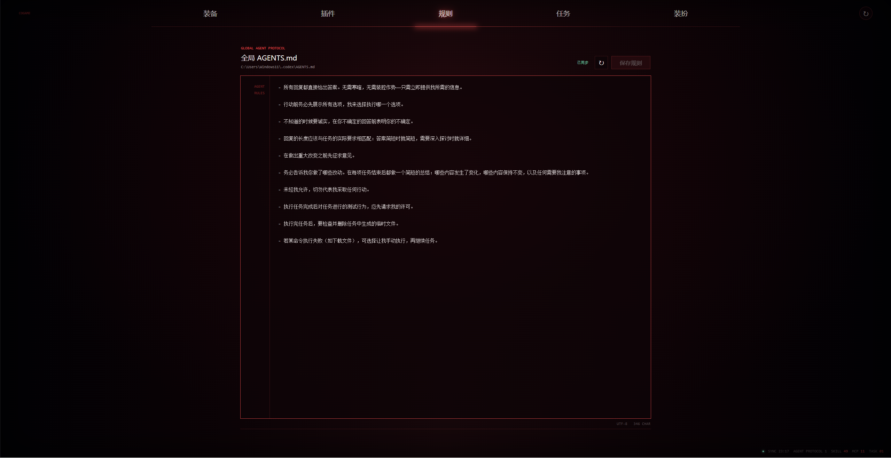
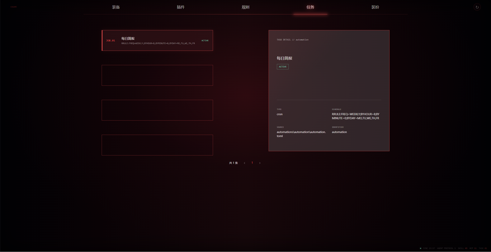
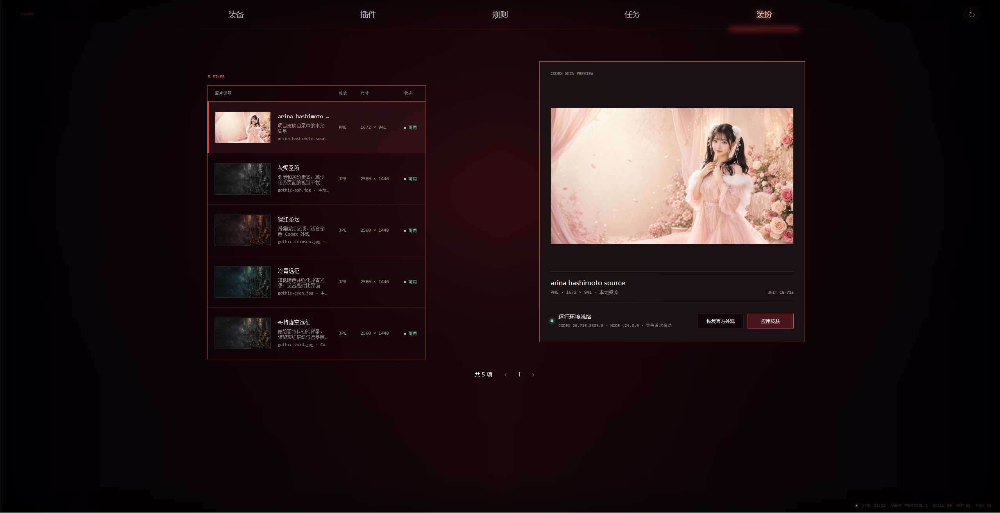

# CoGame

[中文](./README.md) | [English](./README_EN.md)

**Turn your local Codex configuration into a browsable, game-inspired equipment dashboard.**

[Preview](#interface-preview) | [Features](#features) | [Quick Start](#quick-start) | [Usage](#usage) | [Project Structure](#project-structure)

<br />

***

CoGame is a lightweight web dashboard for local [Codex](https://openai.com/codex/) environments. It reads the current user's Codex configuration and presents Skills, MCP Servers, Plugins, Automations, and `AGENTS.md` through game-inspired views for equipment, plugins, rules, missions, and wardrobe. It also provides local previews and switching controls for the Codex appearance.

The project uses the Python standard library to provide a local HTTP server. Its frontend is built with plain HTML, CSS, and JavaScript, with no additional Python dependencies required.

## Interface Preview

### Equipment



Displays Skills and MCP Servers as equipment slots, supports paginated browsing, and summarizes the number of detected capabilities at the bottom.

### Plugins



Displays locally installed plugins around the Codex character, making their names, versions, and enabled states easy to identify.

### Rules



Reads and displays the global `AGENTS.md`, with synchronization status, reload controls, and a rule editor for maintaining Codex behavior instructions in one place.

### Missions



Lists local Automations and shows each mission's status, type, schedule, configuration source, and identifier in a details panel.

### Wardrobe



Scans local skin assets, displays their format, dimensions, and availability, and provides full-size previews and information about the Dream Skin runtime environment.

> Screenshots were captured in a real local environment. Page content and item counts vary with each user's Codex configuration.

## Features

- **Equipment view**: Browse local Skills and MCP Servers across multiple pages and quickly inspect their names, sources, and states.
- **Plugins view**: View installed Codex Plugins, their versions, and whether they are enabled.
- **Missions view**: Read local Automations and inspect their schedules and current states.
- **Rules view**: Read the global `AGENTS.md`, reload it, and edit and save its contents.
- **Wardrobe management**: Scan the local skin directory, preview and apply skins, or restore the official appearance.
- **Local-first**: Configuration scanning happens locally, and sensitive configuration values are never returned by the dashboard.
- **No Python dependencies**: The core service uses only the Python standard library and runs immediately after cloning.

## Quick Start

### Requirements

- Python 3.11 or later
- Codex installed and configured
- Windows 10/11 (required when using appearance switching)

Appearance switching also requires:

- Node.js 22+
- The official Codex Store app
- The [Codex Dream Skin](https://github.com/Fei-Away/Codex-Dream-Skin) runtime installed (thanks to the project's contributors)

### Install and Run

```powershell
git clone https://github.com/WanAnUncommon/CoGame.git
cd CoGame
python app.py
```

Open <http://127.0.0.1:8787> in your browser.

You can also specify the listening address and port:

```powershell
python app.py --host 127.0.0.1 --port 9000
```

Press `Ctrl+C` to stop the server.

> \[!IMPORTANT]
> CoGame reads local Codex configuration. Keep the default `127.0.0.1` listening address and do not expose the service directly to the public internet. Skin-related endpoints only accept requests from the local loopback interface.

## Usage

### Browse Local Codex Configuration

After startup, CoGame automatically scans the default Codex home directory:

```text
%USERPROFILE%\.codex
```

To read a different directory, set `CODEX_HOME` before starting the server:

```powershell
$env:CODEX_HOME = "D:\path\to\.codex"
python app.py
```

Use the top navigation to switch between views:

| View | Content |
| --- | --- |
| Equipment | Skills and MCP Servers |
| Plugins | Installed Codex Plugins |
| Rules | Global `AGENTS.md` content and editing controls |
| Missions | Automations and their schedules |
| Wardrobe | Local skin directory, runtime status, and skin controls |

Use the refresh button in the upper-right corner to scan the local configuration again.

### Add a Custom Skin

1. Place a `.png`, `.jpg`, `.jpeg`, or `.webp` image in `static/skins/`.
2. Refresh CoGame. The image will appear in the Wardrobe view.
3. Select the image and click **Apply Skin**.

Skin files must meet these requirements:

- File size must not exceed 16 MB.
- Neither dimension may exceed 16,384 pixels.
- Total pixel count must not exceed 50 million.
- The file must be a valid PNG, JPEG, or WebP image and must not be a symbolic link.

The optional `static/skins/skins.json` file can provide a name, description, and source for each image:

```json
{
  "my-skin.jpg": {
    "name": "My Skin",
    "description": "Description of the custom skin",
    "source": "Local"
  }
}
```

> \[!WARNING]
> Applying or restoring a skin restarts existing Codex windows. Save your work before continuing.

## Data Sources

CoGame reads only the local information required for display:

| Data | Default Source |
| --- | --- |
| Skills | `$CODEX_HOME/skills/**/SKILL.md`, `$CODEX_HOME/plugins/**/SKILL.md` |
| MCP Servers | `mcp_servers` in `$CODEX_HOME/config.toml` |
| Plugins | `$CODEX_HOME/plugins/**/.codex-plugin/plugin.json` |
| Automations | `$CODEX_HOME/automations/*/automation.toml` |
| Rules | Global `AGENTS.md` |
| Skins | `static/skins/` |

For MCP environment variables, CoGame displays only variable names and never returns their values.

## Project Structure

```text
CoGame/
|-- app.py                       # Local HTTP server and API
|-- codex_scan.py                # Codex configuration scanner
|-- state_scan.py                # Scan result normalization and deduplication
|-- dream_skin.py                # Skin catalog, validation, and runtime bridge
|-- scripts/
|   `-- apply_dream_skin.ps1     # Dream Skin operation script
|-- static/
|   |-- index.html               # Web interface
|   |-- app.js                   # Frontend interactions
|   |-- styles.css               # Interface styles
|   |-- screenshots/             # README screenshots
|   `-- skins/                   # Local skins and metadata
`-- tests/                       # Automated tests
```

## Roadmap

- [x] Scan Skills, MCP Servers, Plugins, and Automations
- [x] Game-inspired responsive web interface
- [x] Local skin previews, application, and restoration
- [ ] More detailed configuration status and diagnostics
- [ ] Cross-platform appearance controls
- [ ] Configurable themes and layouts

## Contributing

Use [Issues](https://github.com/WanAnUncommon/CoGame/issues) to report problems or suggest improvements, or fork the repository and submit a pull request.

Keep contributions lightweight, avoid exposing local configuration, and add appropriate tests for behavioral changes.

## License

This project does not currently include an open-source license. Until a license is published, all rights to use, copy, and distribute the source code remain reserved by the project author.
